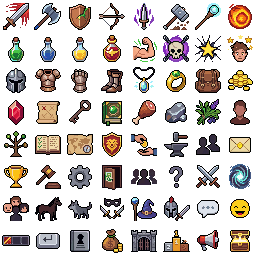

# Action Bar & UI System Menu Sprite Sheets

This directory contains pixel art buttons and icons designed for RPG action bars, shortcut hotbars, system menus, status indicators, and gameplay interface controls.

---

## 🖼️ Sprite Sheets Preview

### Part 1

### Part 2

---

## 📋 Asset Breakdown

* **System & Navigation Icons**:
  * Settings / Cogs
  * Quest Logs / Books / Maps
  * Letters / Mail / Communications
  * Character profiles / Player face placeholders
  * Inventories / Bags / Pouches
* **Ability & Hotbar Buttons**:
  * Blank button frames / borders
  * Passive / Active skill toggles
  * Swords, shields, daggers, bows, and wizard staves
  * Spell icons (elements, magical sparks, shields)
  * Stat icons (health heart, mana star, experience bar ticks)

---

## 🔗 References
* **Original File (Part 1)**: [`../../downloads/pixellab-Icons-for-action-bar--system-m-1783701283333.png`](../../downloads/pixellab-Icons-for-action-bar--system-m-1783701283333.png)
* **Original File (Part 2)**: [`../../downloads/pixellab-Icons-for-action-bar--system-m-1783701443280.png`](../../downloads/pixellab-Icons-for-action-bar--system-m-1783701443280.png)
