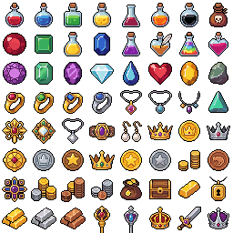

# Potions, Gems, & Jewels Sprite Sheet

This directory contains pixel art items ideal for fantasy RPG inventories, loot systems, and crafting recipes.

---

## 🖼️ Sprite Sheet Preview

---

## 📋 Asset Breakdown

The sheet contains a grid layout of various fantasy item sprites:

* **Potions & Elixirs**:
  * **Healing Vials**: Red potions in spherical and test-tube flask shapes.
  * **Stamina & Mana Vials**: Blue, purple, and green potions.
  * **Poisons & Status Effects**: Dark-green/yellow toxic vials, bubbling flasks.
* **Gems & Crystals**:
  * **Raw Crystals**: Crystal shards in red, cyan, green, and gold.
  * **Cut Gems**: Diamonds, rubies, sapphires, and emeralds.
* **Jewelry & Treasures**:
  * Rings (gold/silver with gems), crowns, pendants, and amulets.

---

## 🔗 References
* **Original file**: [`../../downloads/pixellab-Icons-for-potions--gems--jewel-1783701644361.png`](../../downloads/pixellab-Icons-for-potions--gems--jewel-1783701644361.png)
